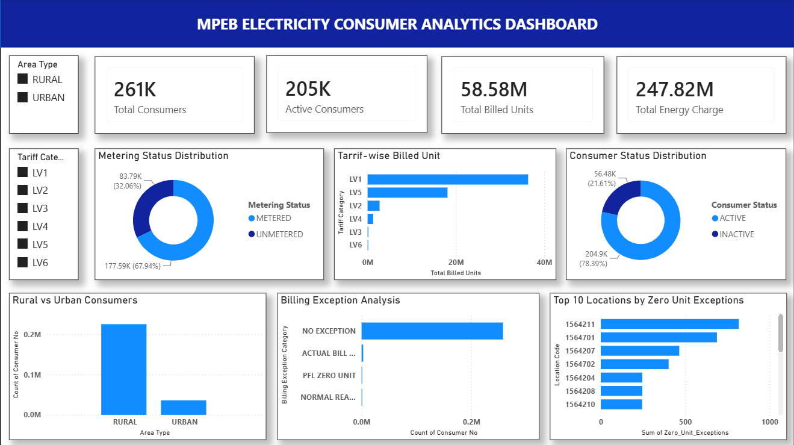
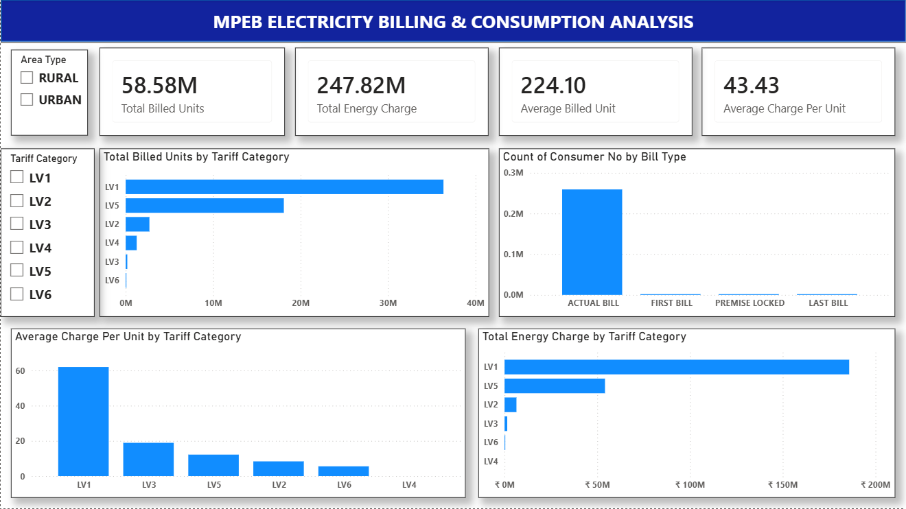
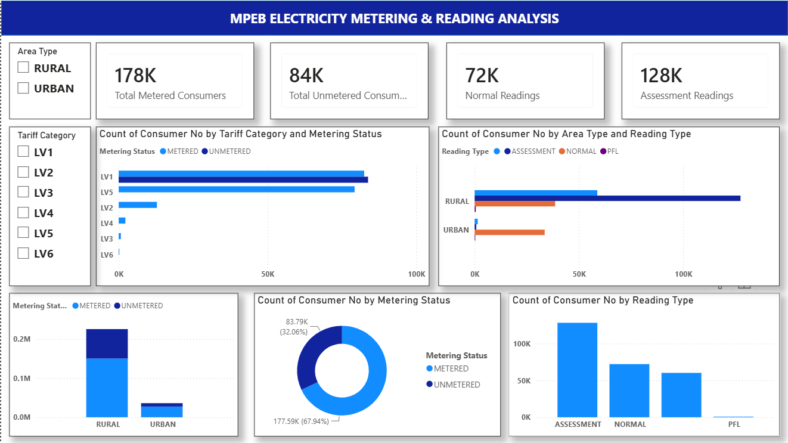
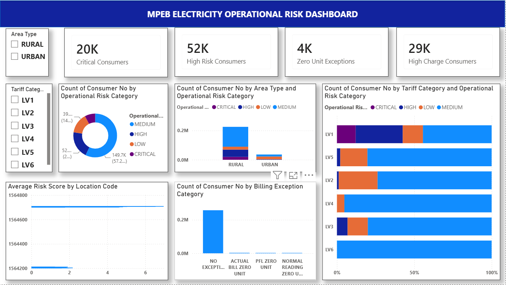
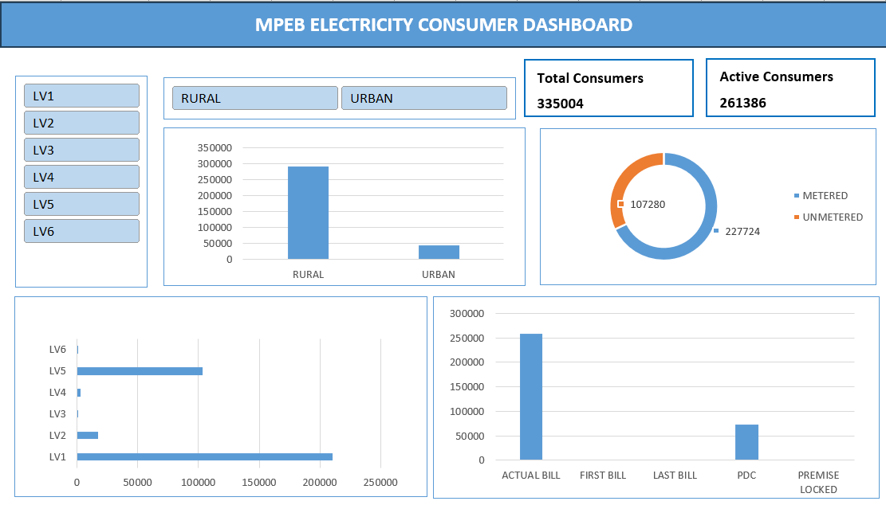

# ⚡ MPEB Electricity Consumer Analytics

An end-to-end **Data Analytics Project** built using **PostgreSQL, Python, Advanced Excel, Power BI, and Statistics** to analyze electricity consumer data and create interactive dashboards for business reporting.

# 📌 About the Project
IMPORTANT POINT :- THIS ENTIRE PROJECT IS DONE ON REAL TIME DATA WITH SOME CHANGES IN DATA FOR PRIVACY END.

MPEB Electricity Consumer Analytics is an end-to-end Data Analytics project developed to analyze electricity consumer data and generate meaningful business insights.

The project focuses on understanding consumer behavior, electricity consumption, billing trends, metering status, reading information, and operational performance through SQL analysis, Python, Advanced Excel, and interactive Power BI dashboards.

The complete workflow starts from raw data auditing and cleaning, followed by feature engineering, exploratory data analysis (EDA), statistical analysis, SQL-based business analysis, dashboard development, and business reporting.

The objective of this project is to demonstrate a complete Data Analytics workflow and showcase practical skills in data cleaning, analysis, visualization, and dashboard development using real-world electricity consumer data.

---

# 📌 Project Overview

This project focuses on analyzing electricity consumer data to understand:

- Consumer distribution
- Electricity consumption
- Billing analysis
- Metering status
- Reading analysis
- Business insights through dashboards

The project demonstrates the complete Data Analytics workflow from raw data to interactive dashboards.

---

# 🎯 Objectives

- Clean and prepare the dataset
- Perform Exploratory Data Analysis (EDA)
- Analyze electricity billing data
- Perform SQL-based analysis
- Create an interactive Excel Dashboard
- Build Power BI Dashboards
- Generate business insights

---

# 🛠️ Tools & Technologies

- PostgreSQL
- Python
- Pandas
- NumPy
- Matplotlib
- Advanced Excel
- Power Query
- Power BI
- Git & GitHub

---

# 📂 Project Structure

```text
MPEB_Electricity_Analytics
│
├── 01_Raw_Data
├── 02_Data_Audit
├── 03_Data_Cleaning
├── 04_Advance_Excel
├── 05_SQL_Analysis
├── 06_Python_EDA
├── 07_Statistical_Analysis
├── 08_Power_BI_Dashboard
├── 09_Project_Documentation
├── 10_Images
└── README.md
```

---

# 📊 Dashboards

## 1️⃣ Consumer Overview Dashboard

- Total Consumers
- Active Consumers
- Area-wise Distribution
- Tariff Category Analysis
- Consumer Status
- Metering Status



---

## 2️⃣ Billing & Consumption Dashboard

- Total Billed Units
- Total Energy Charge
- Average Billed Unit
- Average Charge Per Unit
- Tariff-wise Consumption
- Bill Type Analysis



---

## 3️⃣ Metering & Reading Dashboard

- Metered vs Unmetered
- Reading Type Analysis
- Area-wise Metering
- Tariff-wise Metering
- Reading Distribution



---

## 4️⃣ Operational Dashboard

- Critical Consumers
- High Risk Consumers
- Zero Unit Exceptions
- High Charge Consumers
- Operational Summary



---

## 📈 Excel Dashboard

The Excel dashboard was built using:

- Pivot Tables
- Pivot Charts
- KPI Cards
- Slicers
- Interactive Filters



---

# 🗄 SQL Analysis

The SQL analysis includes:

- Basic SQL Queries
- Intermediate SQL Queries
- Advanced SQL Queries
- GROUP BY
- HAVING
- CASE Statements
- Common Table Expressions (CTEs)
- Window Functions

---

# 🐍 Python Analysis

Python was used for:

- Data Cleaning
- Data Transformation
- Exploratory Data Analysis (EDA)
- Data Visualization
- Statistical Analysis

---

# 📊 Statistical Analysis

The project includes:

- Mean
- Median
- Mode
- Standard Deviation
- Variance
- Percentile Analysis
- Correlation Analysis

---

# 💡 Key Business Insights

- Rural consumers are higher than urban consumers.
- LV1 is the largest tariff category.
- Most consumers receive Actual Bills.
- Metered consumers are higher than unmetered consumers.
- Electricity consumption varies across tariff categories.
- Dashboard filters help compare consumer groups and billing patterns.

---

# 🚀 Skills Demonstrated

- SQL
- Python
- Data Cleaning
- Exploratory Data Analysis (EDA)
- Statistics
- Advanced Excel
- Power BI
- Dashboard Development
- Business Analytics

---

# 👨‍💻 Author

**Harshit Singh**

___
